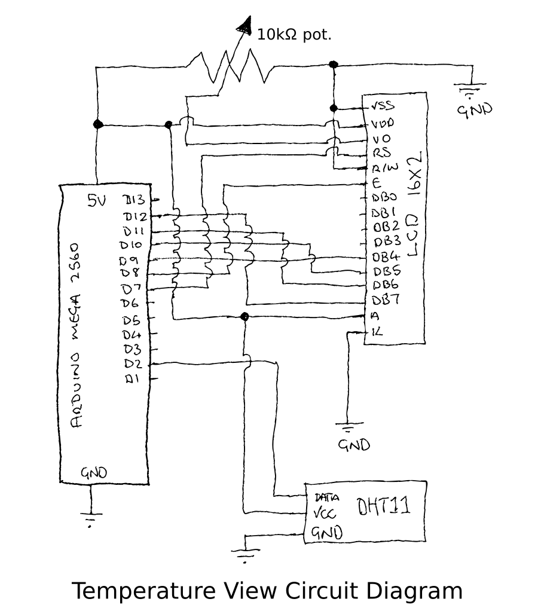

Temperature View
================

.. image:: assets/working.gif
    :align: centre

This project shows the temperature and humidity using the LCD. It uses a `third party library <https://github.com/beegee-tokyo/DHTesp>`_ to recover the DHT11 sensor data and to work out the comfort level. I use parts from the `"ELEGOO Mega 2560 Project The Most Complete Ultimate Starter Kit" <https://www.amazon.co.uk/dp/B01IUZK3JO>`_ for this project.

Set up
------

I use the `arduino-cli <https://github.com/arduino/arduino-cli>`_ as I like to
work from the command line. I install this using `Homebrew <https://brew.sh/>`_
on Mac OSX. I have Arduino IDE installed, however I only use it for the serial
monitor. I haven't yet figured out how to do this from the command line. I have
also installed the FTB USB to virtual serial port driver for OSX.

.. code-block:: bash

	# To install command line on OSX:
	brew install arduino-cli

Next up install the dependancies for the project. These are all configured in
the Makefile. Your mileage my vary with this.

.. code-block:: bash

	make setup

Now wire the project together using the following circuit diagram.

Once wired together plug-in the USB cable and the compile and upload the code.
I've created a handy make target for this:

.. code-block:: bash

	make all
